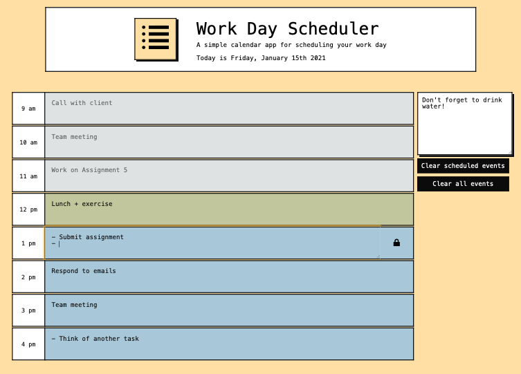

# Work Day Scheduler

The project goal was to create a simple scheduling app for standard work hours. The user can input events into the desired timeblock, and events are saved in the browser by clicking the lock button, or by clicking outside of the text input area. Events are stored in the browser via localStorage.

Event timeblocks change their background colours to indicate whether the event is in the past (grey), present (green), or future (blue).

The user can clear all present/future events via the 'Clear scheduled events' button, or clear all past/present/future events via the 'Clear all events' button.

A simple notepad is also saved in the browser via localStorage.

The layout was created with Bootstrap, with additional styling via custom CSS. JQuery ws used in combintion with javaScript. Date and time were managed with Moment.js.

The page can be found [here](https://amelia-was.github.io/work-day-schedule/)

## Built Using
- HTML
- CSS
- Bootstrap
- jQuery
- Moment.js
